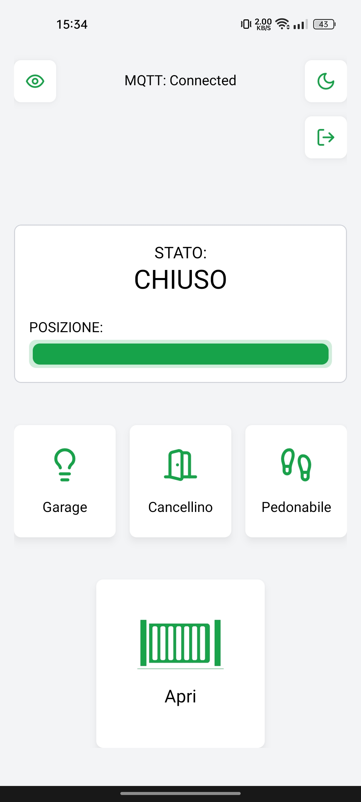
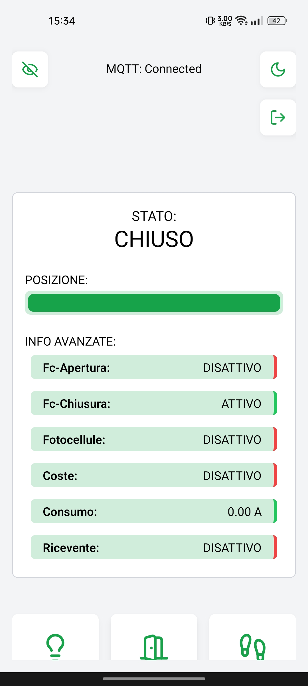
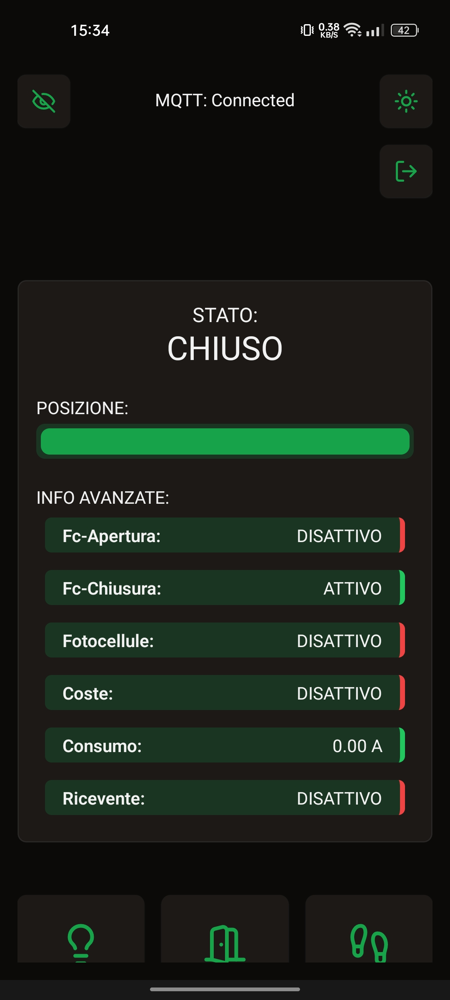
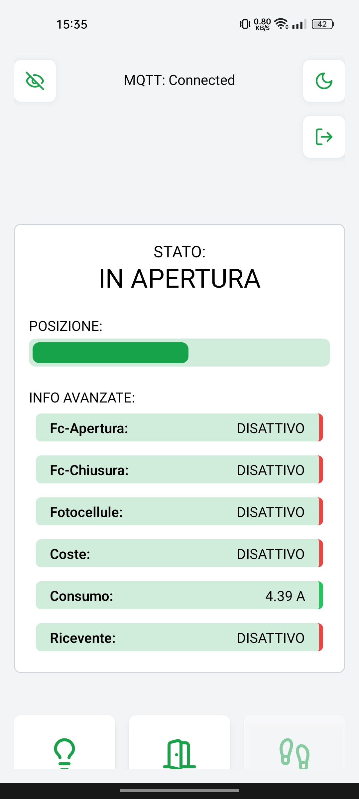
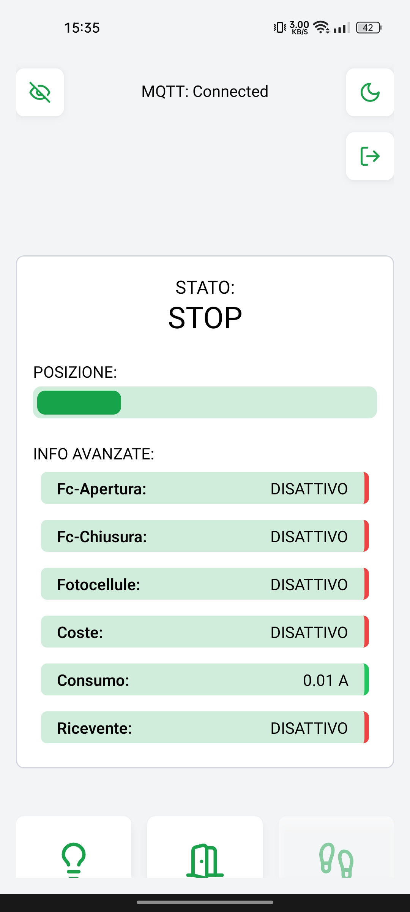

# AutomaticGate Mobile App

- Mobile App for Automatic Gate Control using MQTT protocol

## Tech Stack

- React
- React Native
- NativeWind
- Mqtt
- Expo Go

## Screenshots

    
    

    
    

    
    

## 🔗 Links

